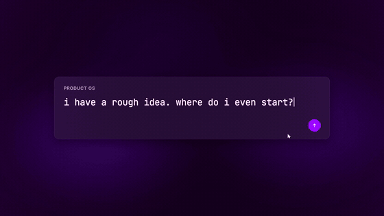

# Keyframe

**Launch videos generated in code — no After Effects, no motion designer.**

The bet: a language model cannot *see* motion, but it can follow numeric law and
read a still grid. So everything here converts motion into two things a model can
actually work with — **numbers** (frame counts, easing names, measured velocity
profiles) and **contact sheets** (frames as a timecoded grid).



▶ **[Watch the full 26s launch video](demo/product-os-launch.mp4)** — built entirely
by this pipeline, music beat-locked, no manual keyframing anywhere.

---

## What this actually is

Three things that only work together:

1. **A vocabulary.** ~45 named moves with exact parameters (`maskWipeUp`:
   `y 110%→0 over 16f, expoOut, per-line stagger 3f`). A model composing from
   named moves with sane defaults produces good motion; a model writing raw
   `interpolate()` calls produces 2015 PowerPoint.
2. **A measurement tool.** `analyze.py` turns any video — including your own
   render — into a shot table, three motion curves, and contact sheets. This is
   how the model reviews its own work.
3. **A reference library.** 25 machine-readable specs describing how a real
   motion designer ([@byshubh_](https://x.com/byshubh_)) builds launch videos,
   each with a `remotion_recipe` naming the mechanism to reproduce it.

## Quickstart

```bash
git clone https://github.com/debanwita27/keyframe && cd keyframe
cd video && npm install && cd ..

python3 pipeline/make_sfx.py      # synthesise the SFX layer (no licensing risk)
./pipeline/fetch_music.sh         # the CC BY track the film ships with

# build a cut end-to-end (locks the edit to the track, renders, masters, verifies)
./pipeline/build.sh audio/raw/digital-lemonade.mp3 my-cut --at 127.3

cd video && npx remotion studio   # live preview while authoring
```

`build.sh` exists because `set_music.py` rewrites `beatgrid.ts` globally — render
straight after setting a *different* track and you get a file whose name says one
track and whose audio is another. It happened twice here. The script ties the two
together and fails on a frame-count mismatch, which is the only reliable check:
two tempos cannot produce the same length.

Optional — rebuild the reference corpus (not shipped, see [Licensing](#licensing)):

```bash
./pipeline/fetch_refs.sh --analyze
```

## Updating the demo video — read before you re-render

`demo/product-os-launch.mp4` is ~21MB and git stores a **complete new copy on every
commit**. It was re-committed five times while the film was being iterated, which
is 107MB of history for one 27-second video, and it is most of this repo's clone
size.

So: **do not re-commit a rebuilt demo.** Either

- upload the new render as a **GitHub Release asset** and point the README link at
  it — zero repo growth per update, or
- keep only `demo/preview.gif` (2.9MB) inline and drop the mp4 entirely.

The existing history cannot be shrunk without a force-pushing rewrite, which would
break every existing clone. Left alone deliberately.

## Layout

```
keyframe/
├── pipeline/
│   ├── analyze.py          video → shot table, motion curves, contact sheets
│   ├── analyze_audio.py    music → tempo, BEAT CONFIDENCE, sections, beat grid
│   ├── set_music.py        swap in any track and re-lock the edit to its beats
│   ├── make_sfx.py         synthesises whooshes/impacts/risers from numpy
│   ├── MOVE_VOCAB.md       ~45 named moves with exact params
│   ├── PRINCIPLES.md       the taste, written as numbers
│   ├── SPEC_TEMPLATE.yaml  one schema for describing refs AND authoring new work
│   ├── build.sh            one cut end-to-end: set track, render, master, verify
│   ├── post.sh             grade + grain + bloom + two-pass loudnorm
│   ├── fetch_refs.sh       rebuild the reference corpus locally
│   └── fetch_music.sh      fetch + rank candidate tracks
├── refs/specs/             25 motion specs — the reference library
├── video/src/moves/        the move library (implements MOVE_VOCAB)
├── video/src/lib/film.tsx  shot sequencing, beat grid, shot-timing audit
└── video/src/compositions/product-os/   the Product OS launch film
```

## The loop that makes it work

```bash
# 1. author      cd video && npx remotion studio
# 2. render      npx remotion render src/index.ts ProductOSLaunch out/raw.mp4
# 3. grade       ../pipeline/post.sh out/raw.mp4 out/final.mp4 clean
# 4. CRITIQUE    python3 pipeline/analyze.py video/out/final.mp4 --out out-analysis
```

**Step 4 is not optional.** On the first cut of this film it caught: 672 dead
frames, a 3-second lifecycle rail with literally zero movement, type too small for
the frame, dark cards invisible against a dark background, a synthetic cursor that
never reached the button it was supposed to click, and ambient drift pushing a
word off the right edge. None of it was visible from reading the code.

Read `profile.md`, then **look at the contact sheets**. Composition problems that
are invisible in motion are obvious in a still grid.

## What `analyze.py` reports

- **shot table** — cuts with frame durations, plus each shot's measured velocity
  profile (`ease-out (fast in, settles) + overshoot/settle bounce`)
- **three motion curves** — per-frame delta, 8-frame window delta, and loudest
  8×8 tile. All three are needed: a per-frame mean calls a correct slow camera
  drift "dead", and a whole-frame mean calls text typing into a small card
  "dead". A stretch is flagged frozen only when all three are flat.
- **frozen stretches** — a bug list, not an observation
- palette with screen-share %, brightness curve, per-shot motion centroid

Contact sheets: `fps=6`, 6×6, frame number and timecode burned into every cell.

## Music

`analyze_audio.py` is the audio counterpart — ffmpeg → mono → STFT → spectral
flux onsets → autocorrelation for tempo → comb-filter phase search → per-bar
energy → sections. Pure numpy, no librosa.

Pick a track on **beat confidence** (0..1): how far the winning autocorrelation
lag stands above its neighbours, combined with how consistently its harmonics
also peak. A drum machine scores high, a rubato piano low.

```
track                     BPM  conf  beat_f  bar_f  sections
dirt-rhodes              82.0  0.87   21.94   87.8         5
digital-lemonade        120.2  0.81   14.98   59.9         9   <- chosen
neon-laser-horizon       79.5  0.81   22.64   90.6         6
machinations            139.7  0.78   12.89   51.5         6
hackbeat                161.5  0.74   11.15   44.6        14
deuces                   94.0  0.66   19.16   76.6         7
```

`dirt-rhodes` scored highest but is 82 BPM funk — wrong energy, and an 87.8f bar
forces 3-second shots. `digital-lemonade` won on fit: **14.98f per beat**, which
matches the 15f grid the edit was already cut on.

The window (127.30s–153.27s of the source) was picked off the section table:
3 quiet bars → the track's strongest passage → outro. So the damped intro and
outro sit where the music is *already* quiet instead of fighting it.

`beatgrid.ts` is generated from the track's **detected beat times**, not a nominal
grid, so the edit cannot drift. Verify on the finished file rather than
re-estimating tempo from a short excerpt (this one re-analyses as 79.5 BPM — a
3:2 octave error):

```
onset strength at the 13 cuts        1.006
onset strength at 400 random frames  0.518   → cuts land 1.94× stronger than chance
```

### Bring your own track

The shot list is expressed in **beats, not frames** — so swapping music retimes
the edit instead of breaking it. Subscription libraries (Envato Elements has a
[launch-video category](https://elements.envato.com/audio/launch), Artlist,
Musicbed) are better targeted than CC music and worth using for real work:

```bash
python3 pipeline/set_music.py ~/Downloads/that-envato-track.mp3
cd video && npx remotion render src/index.ts ProductOSLaunch out/raw.mp4
```

It analyses the track, picks a downbeat that starts on a quiet section so the
damped intro lands where the music is already quiet, regenerates `beatgrid.ts`
from real beat times, and trims the window into `video/public/`. It warns if beat
confidence is below 0.55 — some tracks simply don't have a pulse you can cut to.

#### Which library actually covers a company launch video

Verify current terms yourself — this is a summary, not legal advice — but the
traps are consistent:

| source | commercial company launch video? |
|---|---|
| **incompetech** (Kevin MacLeod, CC BY 4.0) | Yes, attribution required. What ships here. |
| **freetouse.com** — free tier | **No.** *"Use of the Digital Assets in Commercial Content... is strictly prohibited."* |
| **freetouse.com** — paid | Yes (Commercial/Pro), no attribution |
| **Epidemic Sound** — Creator | **No.** *"can't use our music in digital advertising, marketing, or promotion for a brand or company"* |
| **Epidemic Sound** — Business | Yes — marketing, corporate/explainer, internal comms. Caps at **<$10M company revenue** |
| **Epidemic Sound** — Enterprise | Required above that cap |
| **Envato Elements** | Yes, with per-project licence registration |

The film ships pointed at the CC BY track because that is the only one this repo
can legally redistribute. The internal cut uses a Free To Use track instead;
`.gitignore` excludes `video/public/ft-*.mp3` so restricted audio never lands in
a commit. Swap either way with `set_music.py` — the duck envelope and every shot
length re-derive themselves from whichever track you point it at.

Two things that catch people out:

- A "free" tier almost never covers a company's own launch video. Free usually
  means *personal channel*, and a product announcement is commercial content
  even when it is posted to a company social account.
- **"Internal only" does not mean non-commercial.** Epidemic lists *"corporate
  videos, explainer videos, and internal communications"* as Business-plan uses —
  they would not enumerate internal comms under a paid business tier if it were
  exempt. Company use is business use regardless of audience.
- Epidemic's Business **and** Pro plans exclude companies above ~$10M revenue —
  larger organisations need Enterprise. Check whether marketing already holds a
  seat somewhere before buying anything.

Epidemic's genuine edge: anything published during an active subscription stays
cleared permanently, even after cancelling. The others don't guarantee that as
cleanly.

#### Internal launches

Licence terms and practical risk are different questions. Strictly, an internal
corporate video still needs a commercial/business licence under all of the paid
libraries. Practically, enforcement runs through Content ID and platform
takedowns, so a video that never leaves Slack trips none of it.

The operational risk is not legal-theoretical, it is that **internal videos get
reused.** An all-hands clip becomes a careers-page embed months later and the
licence problem arrives retroactively, after nobody remembers which track it was.

This is why the default here is CC BY rather than a free tier: Kevin MacLeod's
licence permits commercial use outright — internal or external, no distinction —
and asks only for a credit line. For an internal launch that is one line in the
post announcing it, and it keeps holding if the video ever escapes internal.

**Source audio must never be committed.** Every subscription library (Envato,
Artlist, Musicbed, Epidemic, freetouse) permits use in an end product but forbids
redistributing the files, and each project needs its own licence registration on
their side. `audio/raw/` is gitignored; keep your own `video/public/*.mp3` out of
commits too.

### Syncing the animation, not just the cuts

Landing cuts on beats is the easy half. Three things had to be fixed before it
actually felt locked:

1. **Phase drift.** The beat grid is fitted with one global tempo and phase, so a
   window 76s into a track sat a third of a beat off even though the grid was
   right on average. `set_music.py` now searches ±half a beat and moves the window
   start to wherever the cuts sit on the loudest onsets (measured: 5 frames late,
   corrected to within 1 frame — 86% of peak onset alignment).
2. **Internal keyframes off the grid.** Every shot's cut was on the beat, but the
   reveals inside it started at +2 to +8 frames, so each animation lagged the
   music by up to 0.27s. `beatgrid.ts` now exports `BEAT_F` and a `b()` helper,
   and shot-internal keyframes are multiples of it — `b(1)`, `b(1.5)`, `b(2)`.
3. **Ambient phase reset.** `useCurrentFrame()` inside a `<Sequence>` is
   sequence-local, so every shot restarted its gradient and camera drift from
   phase 0 and the background visibly jumped at each cut. `ShotPhase` context
   supplies each shot's absolute start frame so ambient motion runs on one clock.

Related: content drift is now opt-out per shot (`driftContent={false}`). A prompt
card is a fixed object; drifting it made the textarea appear to wander. The
background still moves, so the frame stays alive.

### Reading time is a function of tempo

`SHOT_BEATS` is weighted by **reading load**, not importance. A frame with five
word-chips or six labelled documents needs longer than one shape moving, and an
even cut rhythm across both is what makes a text-heavy product video feel rushed.
Visual beats get 3–4; text-heavy ones get 5–6. Because it is expressed in beats,
a slower track automatically grants more reading time.

The opening was also cut down: a separate blank-prompt beat was removed and the
card entrance folded into the typing shot. That reaches the wordmark in 3.7s
instead of 5.2s, and makes the accent underline's whoosh the first one in the
film — previously a whoosh on the title cut sat 21 frames before it and the two
read as one doubled sound.

### Mixing

Layering happens in Remotion (`product-os/mix.tsx`), not ffmpeg — every hit needs
a specific *frame*, and the mix stays versioned next to the edit. `HITS` is a flat
data array so it can be read and retimed without touching JSX. SFX are
**synthesised** by `make_sfx.py` (filtered noise sweeps, pitch-dropping sub
thumps) — deterministic and licence-free.

**Don't fight the music — use it.** The music's own hit on the cut was being heard
as the mouse click, because it landed exactly as the cursor started moving. Muting
that beat was the obvious fix and the wrong one: it is a downbeat, and a hole in
the music reads as a broken render. Instead the cursor now travels during the
*previous* shot's tail and arrives on the cut, so the track's transient and the
click are the same event — measured 1.5 frames apart, which fuses perceptually.

**A sound that is inaudible is worse than no sound.** The cursor's click was
scored to the exact right frame and still read as badly mistimed, because the
generic `tick` measured only **1.2x above the music bed** — so the ear paired the
cursor with the nearest loud transient, which was the music's own hit landing as
the cursor began to move. Fixing the timing could never have worked; the fix was
a dedicated broadband `click` (bright HF spike + mid body + low thud) at 0.95,
which measures **7.7x** and reads correctly. Verify SFX audibility against the
bed, not just their frame numbers:

```
onset in the 2-4kHz band around the click frame:
  tick  @ 0.30   1.2x above bed   inaudible
  click @ 0.95   7.7x above bed   reads
```

Every sound is scored to a specific frame, and where a sound has an on-screen
cause the two must be the same frame — the synthetic cursor's click SFX sits on
its exact arrival frame (`at(1) + b(1)`), not near it. Cursor travel is a full
beat: half a beat across 400px read as a jump rather than a move.

SFX are used sparingly on purpose. Once cuts are beat-locked, the track's own
transient marks most of them — a whoosh on all six capability cuts read as a
template, so it is two. Accents (ticks, soft impacts) fire on things that would
plausibly make a sound: a tick landing, chips snapping into order, the accent
underline sweeping in under the wordmark.

ffmpeg does the master. **Two-pass `loudnorm` with `linear=true`** — single-pass
applies *dynamic* gain, which flattened this mix badly: it pulled the ducked open
up by 14 dB and collapsed the loudness range to 3.8 LU, destroying the drop.
Measuring first, then applying one constant gain, preserves the envelope:

```
                 mean      final master: -13.1 LUFS, LRA 9.8 LU
open           -29.7 dB
pre-drop duck  -26.5 dB
DROP           -17.2 dB   ← +9.3 dB, which is what makes the cut land
capability     -14.3 dB
end card       -18.0 dB
```

## Masking a specular sweep

`SpecularSweep` lays a gradient band across a rectangular box — right for a glass
card, wrong for type: you see the band's straight edges crossing the letters
instead of light travelling along them. `ShineText` renders the text twice, solid
underneath and gradient on top with `background-clip: text`, so the highlight only
exists inside the glyphs.

Two things that make it actually visible:

- The base colour must sit **below** white. A white shine over near-white type has
  nothing to be brighter than, so the sweep disappears even though it is working.
- Give the highlight tinted flanks (`flank`), not just a white core. A single hard
  band reads as a wipe; a core with falloff reads as a curved reflective surface.

## Reading the reference library

Start here — these four cover the most ground:

| spec | why |
|---|---|
| `A_explainer-zhylar-crm-cpq` | 20s SaaS explainer, 15 shots. Closest thing to a text-heavy product done well. |
| `A_best-launch-reel-2026` | a montage of 6+ launches, 11 shots |
| `A_not-your-average-ui-animation` | how to make a real interface the hero |
| `B_dynamic-typography-d3` | type as the subject — what a tool launch needs |

Each spec's `techniques[].remotion_recipe` names the actual mechanism (polar
coords, `strokeDashoffset`, clip-path, CSS 3D, a specific shader approach), and
`avoid:` names what depended on hand-keyframed AE work plus the code-native
substitute.

## Two categories of launch video

The distinction that drives everything in `PRINCIPLES.md`:

**Text-heavy tools** (skills, CLIs, agents) — the product is a capability, so
words carry the load. Never put a whole sentence on screen at once; stage it.
Every abstract claim gets one concrete visual object. `WordSwap` over bulleted
reveals. Typewriter only where a human would actually be typing.

**Visual products** (app, web feature) — the interface is the hero, on screen
inside 2 seconds. Establish once, then `DollyToUI` into the control that matters.
Choreograph a synthetic cursor, because a real screen recording cannot land on a
beat grid.

## Licensing

Code and docs: **MIT**. But read [`LICENSE`](LICENSE) — there is third-party
material it cannot cover:

- **Reference videos are not in this repo.** They belong to
  [@byshubh_](https://x.com/byshubh_). `refs/specs/` is our own written analysis;
  it neither includes nor licenses the underlying footage. Rebuild locally with
  `./pipeline/fetch_refs.sh`.
- **Music is CC BY 4.0** — "Digital Lemonade" by Kevin MacLeod
  (incompetech.com). Commercial use is fine, **attribution is required**. That
  applies to the demo video in this repo too.
- Most CC music on archive.org is NC (bars commercial use) or ND (bars cutting to
  length, which is exactly what we do). Both unusable. And don't trust
  archive.org's `licenseurl` field — it's user-supplied and often wrong.

## Known gaps

- **No vertical cut.** Shots use pixel widths tuned to a 1920 frame; 9:16 needs a
  per-shot layout pass. The three vertical reference specs carry `vertical_notes`
  for exactly this. Deliberately unregistered rather than shipped broken.
- **3D works but is unused.** `three` + `@react-three/fiber` + `@remotion/three`
  render headlessly — `npx remotion still src/index.ts ThreeSmoke out/x.png`
  proves it. The `needs-3d` reference techniques are unbuilt, and true chrome
  needs an **environment map**; without one `metalness: 0.95` just reads dark.
  Add `@react-three/drei`'s `Environment` first.
- **Reference corpus is one designer** — coherent house style, thin on range.
- The lifecycle rail still sits slightly above optical centre.
- Six consecutive left-text/right-object capability beats is a layout the
  references never repeat that many times in a row.
